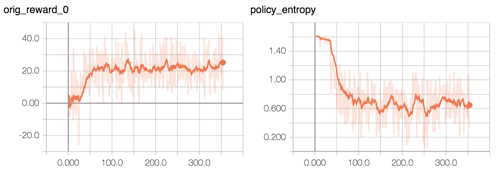

# gym-moving-dot

A reworked version of the gym-moving-dot environment created by mrahtz to support migration from gym to gymnasium.
--
A simple Farama Foundation gymasium environment consisting of a white dot moving in a black
square, designed as a simple test environment for reinforcement
learning experiments.


Observations are given as 210 x 160 pixel image with 3 channels for red, green
and blue; the same size as Atari environments. The white dot has pixel values
(255, 255, 255), while the black square has pixel values (0, 0, 0).

Possible actions are:
- Discrete `action_space`
    * 0: do nothing
    * 1: move down
    * 2: move right
    * 3: move up
    * 4: move left
    * The step_size is configurable, defaults to 1
- Continuous `action_space`
    * Action: 1 x 2 vector for [move_on_x, move_on_y]
    * Range: low <= move_on_x <= high, low <= move_on_y <= high  
      low and high default to -1 and 1 respectively
    * Rules
        ```shell
        # Rules on executing an action
        new_x = original_x_pos + step_size if move_on_x >= threshold else original_x_pos - step_size
        new_y = original_y_pos + step_size if move_on_y >= threshold else original_y_pos - step_size
        ```
    * The step size is configurable, defaults to 1

Rewards are given based on how far the dot is from the centre.
* If the dot moves closer to the centre, it receives reward +1.
* If the dot moves further away from the centre, it receives reward -1.
* If the dot sames the same distance from the centre, it receives reward 0.

The episode terminates after a given number of steps have been taken (by
default 1,000). If `env.random_start` is set to True (the default), the dot
starts in a different position at the start of each episode. Otherwise, the dot
starts at the top left corner.

Training with actor-critic (A2C from OpenAI's baselines with one worker) takes
about five minutes to achieve good reward. After about 20 minutes of training,
expect your graphs to look something like:



## Installation

`pip install --user git+https://github.com/jakal02/gym-moving-dot`

## Dependencies

`pip install -r requirements.txt`

## Usage

```python
import gym
import gym_moving_dot

ENVS = ["MovingDotDiscrete-v0",
        "MovingDotDiscreteNoFrameskip-v0",
        "MovingDotContinuous-v0",
        "MovingDotContinuousNoFrameskip-v0"]

for env_name in ENVS:
    print("=== Test: {} ===".format(env_name))

    env = gym.make(env_name)
    env.random_start = False

    env.reset()

    for i in range(3):
        a = env.action_space.sample()
        o, r, d, info = env.step(a)
        print("Obs shape: {}, Action: {}, Reward: {}, Done flag: {}, Info: {}".format(o.shape, a, r, d, info))

    env.close()
    del env
```

## Update
- 8/19/2023:
    - update to be compatible with 0.29 version of gymnasium
    - human rendering done using pygame
- 1/11/2019:
    - update to be compatible with the latest gym package
    - add the continuous `action_space` version
- 16/12/2019:
    - separate the existing classes into the parent and subclasses
